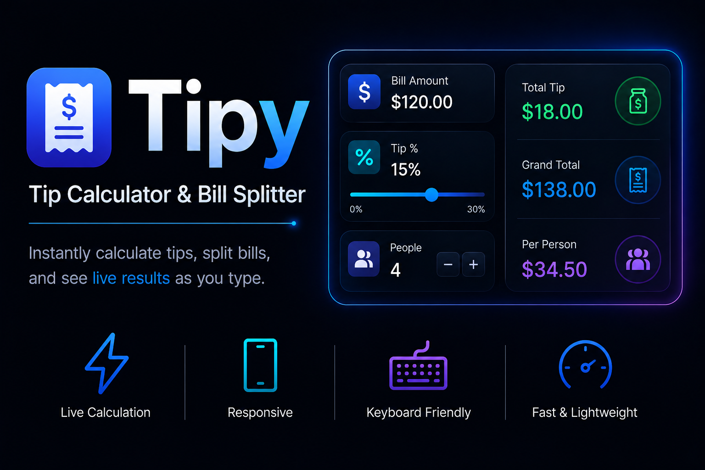

# Tipy — Tip Calculator & Bill Splitter

A single-screen tip calculator that updates live as you type. Built for the Frontend Assessment (Tip Calculator variant).

## Requirements

- [Node.js](https://nodejs.org/) 18 or newer
- npm 9+

## Run locally

```bash
git clone https://github.com/shajiaalianwar55/tipy-tip-splitter.git
cd tipy
npm install
npm run dev
```

Open the URL shown in the terminal (usually `http://localhost:5173`).

## Deployed demo

URL: https://tipy-tip-splitter.vercel.app/

## Project structure

- `src/lib/` — pure parsing, validation, and cent-accurate split math (Vitest-tested)
- `src/components/` — UI inputs and results panel
- `src/hooks/useTipCalculator.ts` — state wiring between UI and lib
- `ANSWERS.md` — assessment write-up (stack, a11y, rounding policy, AI usage)
